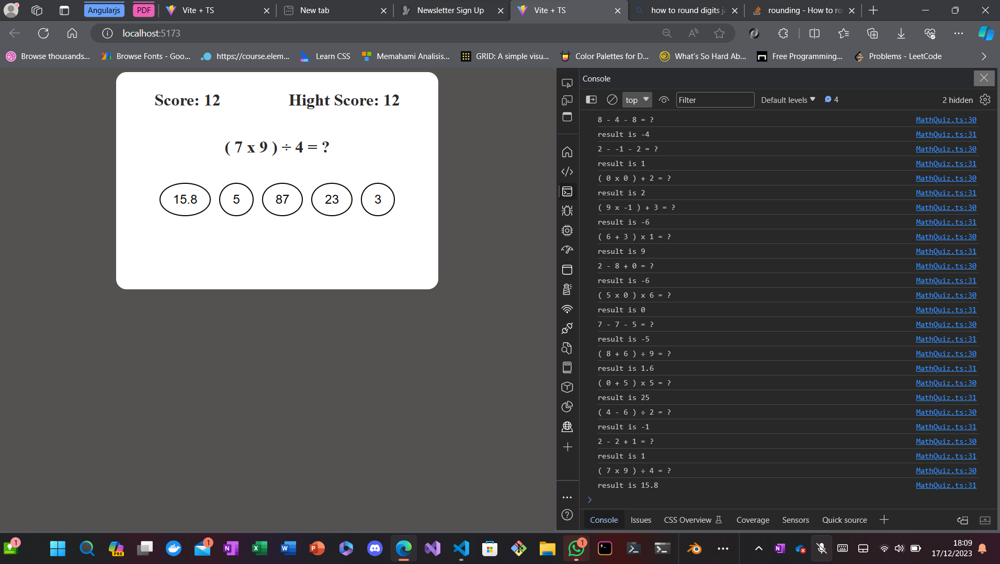

# TYPE-SCRIPT EXERCISE

> learn type script by finish exercise from [typescript exercise](https://typescript-exercises.github.io/#exercise=16&file=%2Findex.ts) web page, there is 15 problem about typeIng on script. also some advance assignment to make some calculator

## 15 exercise from typescript exercise web page

> > there is very difficult task form me because the needs to solve that exercise to understand functional paradigm where there is global data then i need to make the function reusable.

## Make calculator game



------how to run the program--------\
 first install the dependency, with this comment

```bash
npm i
```

then after all get install, run this comment

```bash
npm run client
```
